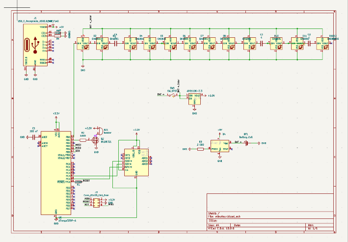
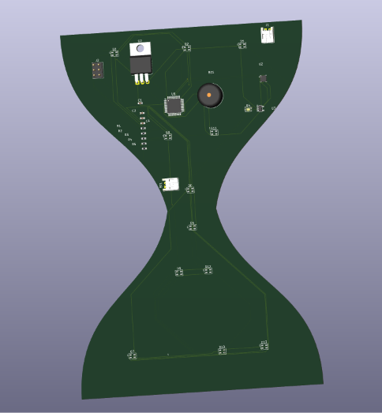

# sablier_electronique

## Présentation

J'ai choisi de construire un minuteur, sablier, qui lance un compte à rebours de 60 sec. 
Le système s'actualise et recommence lorsqu'il est tourné, tel un sablier mécanique.

## Fonctionnement et Composants : 

- Détection de l'orientation avec le LIS3DH
- Microcontrôleur ATmega328P-AU
- 12 LEDs  pour représenter le sable qui s'écoule
- Compte à rebours de 60 secondes
- Buzzer en fin de minuterie
- Batterie rechargeable par USB-C

## Schéma électronique

## PCB

## Vue 3D

## Tests

Le PCB devra être soudé puis testé afin de vérifier :
- la détection de l'orientation ;
- le fonctionnement des LEDs ;
- le décompte de 60 secondes ;
- le fonctionnement du buzzer ;
- la recharge de la batterie.

Je n'ai pas pu achever le traçage des pistes malgré les explications d'un professeur du fablab. Ainsi, il me reste des erreurs d'isolations principalement. 
